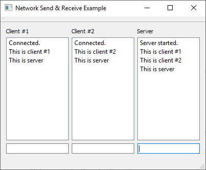

# Network Send & Receive Example
This application was built as a learning exercise to get to know the Qt-way of creating TCP client/server applications. It is closely modelled around the [Fortune Server Example](https://doc.qt.io/qt-5.6/qtnetwork-fortuneserver-example.html)/[Fortune Client Example](http://doc.qt.io/qt-5.6/qtnetwork-fortuneclient-example.html) in regards to [QTcpServer](http://doc.qt.io/qt-5.6/qtcpserver.html) and [QTcpSocket](http://doc.qt.io/qt-5.6/qtcpserver.html) usage from the Qt 5.6 documentation, differing as follows:

| Network Send & Receive Example | Fortune Client/Server Example |
| --- | --- |
| client and server stay connected, allowing them to transfer multiple messages | server closes connection after sending message to client |
| client and server can both send and receive messages | server sends, client receives | 

## What does it do?
This example application creates two clients and one server, all shown in the same dialog. Clients can send messages that appear in the server's list. The server can send messages that appear in both clients' lists.

## Using the source
This code was developed using Qt Creator 4.7.2 with Qt 5.6.2 for MSVC2015. You should be able to open the project file in Qt Creator, configure the project to your Qt kit and that's all.

## Things I learned
- There are differences between Qt 5.6 and 5.11 network implementations. But I chose to use Qt 5.6 on purpose because that's the target platform  for another project I'm working on.
- My main objective was to write simple `TcpClient` and `TcpServer` classes. I'm only interested in "start server", "connect to server", "send message" and "receive message" functionality. (For the sake of keeping this simple, no fancy stuff like multithreading, intricate (re-)connection handling etc.) Very soon during implementation I noticed that there's enough of common ground between client and server in regards to `QTcpSocket` that warrants sourcing this code out into a third class, `TcpConnection`. And once I was done with that I noticed that `TcpConnection` basically _is_ `TcpClient`. Still, I'm keeping all three of them.

## License
[MIT](LICENSE)
